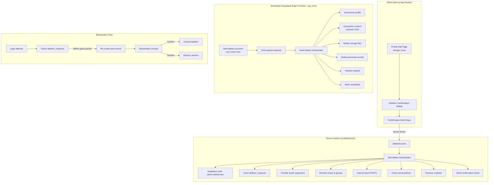
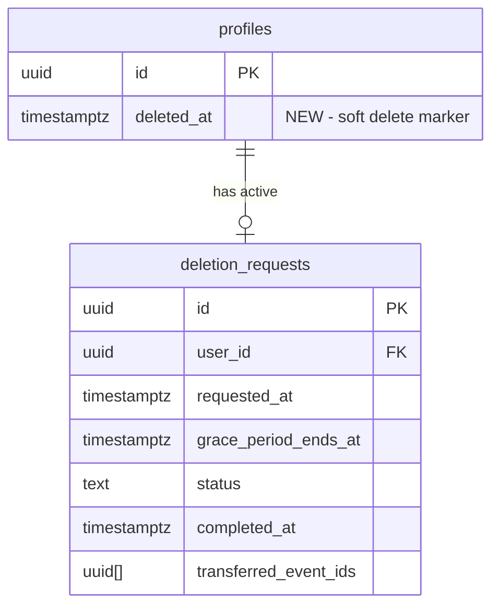

# Design Document: Account Deletion

## Overview

This design implements a two-phase account deletion system for City Pulse: a **soft delete** phase that immediately revokes access while preserving data for a 30-day grace period, followed by a **hard delete** phase that permanently removes personal data and anonymizes user-generated content.

The system is designed around three core principles:
1. **GDPR compliance** — personal data is fully erasable after the grace period
2. **Community continuity** — reviews, messages, and events remain coherent for other users
3. **User safety** — a 30-day window allows recovery from accidental or impulsive deletions

The deletion flow is orchestrated by a server action (`deleteAccount`) that performs soft-delete operations synchronously, and a Supabase Edge Function triggered by `pg_cron` that handles hard-delete operations asynchronously after grace period expiry.

## Architecture



### Key Architectural Decisions

| Decision | Choice | Rationale |
|----------|--------|-----------|
| Soft delete trigger | Server action (synchronous) | User gets immediate feedback; all cleanup is atomic per step |
| Hard delete trigger | pg_cron + Edge Function (hourly) | No user interaction needed; reliable scheduling without external infra |
| Anonymization strategy | Sentinel UUID (`00000000-0000-0000-0000-000000000000`) | Preserves FK integrity; single "Deleted User" profile row handles all display |
| Event transfer target | System account (role = 'system') | Already exists in the schema; events remain queryable |
| Reactivation mechanism | Re-create auth record + prompt | Supabase Auth doesn't support "disable"; re-creation is the only path |
| Transaction scope | Per-step with orchestrator rollback | Full single transaction would hold locks too long across storage calls |

## Components and Interfaces

### 1. Database Migration (`supabase/migrations/066_account_deletion.sql`)

Creates the `deletion_requests` table and the sentinel profile row.

### 2. Server Action: `deleteAccount` (`src/lib/actions/account-deletion.ts`)

```typescript
'use server';

export interface DeleteAccountInput {
  confirmationWord: string;
}

export interface DeleteAccountResult {
  success?: boolean;
  error?: string;
  errorCode?: 'INVALID_CONFIRMATION' | 'RATE_LIMITED' | 'ALREADY_PENDING' | 'AUTH_ERROR' | 'INTERNAL_ERROR';
}

export async function deleteAccount(input: DeleteAccountInput): Promise<DeleteAccountResult>;
```

### 3. Server Action: `reactivateAccount` (`src/lib/actions/account-deletion.ts`)

```typescript
export interface ReactivateResult {
  success?: boolean;
  error?: string;
}

export async function reactivateAccount(): Promise<ReactivateResult>;
export async function declineReactivation(): Promise<ReactivateResult>;
export async function getDeletionStatus(): Promise<{ isPending: boolean; expiresAt: string | null }>;
```

### 4. Soft Delete Orchestrator (`src/lib/actions/deletion/soft-delete-orchestrator.ts`)

Internal module that sequences the soft-delete steps:

```typescript
export interface SoftDeleteContext {
  userId: string;
  userEmail: string;
  userLocale: string;
  displayName: string;
  requestedAt: Date;
}

export interface SoftDeleteStep {
  name: string;
  execute: (ctx: SoftDeleteContext, supabase: SupabaseClient) => Promise<void>;
  rollback?: (ctx: SoftDeleteContext, supabase: SupabaseClient) => Promise<void>;
}

export async function executeSoftDelete(ctx: SoftDeleteContext): Promise<{ success: boolean; failedStep?: string }>;
```

Steps executed in order:
1. `transferEventOrganizers` — transfer future published events, delete drafts
2. `resolveCrews` — remove from crews, promote/delete as needed
3. `resolveGroups` — remove from groups, promote admins
4. `cancelFutureRsvps` — cancel going/waitlist/interested for future events
5. `closeConversations` — close active conversations, decline pending
6. `removeContacts` — delete all contact relationships
7. `cancelCrewInvitations` — cancel pending invitations/requests
8. `removeEventModerators` — remove from event_moderators
9. `deleteAuthRecord` — call admin.deleteUser (point of no return)
10. `createDeletionRequest` — insert into deletion_requests
11. `sendConfirmationEmail` — send email via Resend

### 5. Hard Delete Edge Function (`supabase/functions/hard-delete-accounts/index.ts`)

Triggered hourly by pg_cron. Processes all `deletion_requests` where `grace_period_ends_at <= now()` and `status = 'pending'`.

### 6. UI Components

- `DeleteAccountSection` — danger zone in profile edit page
- `DeletionConfirmationDialog` — modal with consequences + confirmation word
- `ReactivationPrompt` — shown after login during grace period

### 7. Pure Logic Modules

- `src/lib/deletion/confirmation.ts` — confirmation word validation
- `src/lib/deletion/locale.ts` — email locale determination
- `src/lib/deletion/classification.ts` — event/crew/group classification logic

## Data Models

### `deletion_requests` Table

```sql
CREATE TABLE public.deletion_requests (
  id UUID PRIMARY KEY DEFAULT uuid_generate_v4(),
  user_id UUID NOT NULL REFERENCES public.profiles(id),
  requested_at TIMESTAMPTZ NOT NULL DEFAULT now(),
  grace_period_ends_at TIMESTAMPTZ NOT NULL DEFAULT (now() + INTERVAL '30 days'),
  status TEXT NOT NULL DEFAULT 'pending'
    CHECK (status IN ('pending', 'completed', 'cancelled', 'partially_completed')),
  completed_at TIMESTAMPTZ,
  cancelled_at TIMESTAMPTZ,
  reminder_sent_at TIMESTAMPTZ,
  reminder_failed BOOLEAN NOT NULL DEFAULT false,
  had_pending_reports BOOLEAN NOT NULL DEFAULT false,
  transferred_event_ids UUID[] NOT NULL DEFAULT '{}',
  metadata JSONB NOT NULL DEFAULT '{}',
  created_at TIMESTAMPTZ NOT NULL DEFAULT now()
);

-- Indexes
CREATE UNIQUE INDEX idx_deletion_requests_active
  ON public.deletion_requests(user_id)
  WHERE status = 'pending';

CREATE INDEX idx_deletion_requests_expiry
  ON public.deletion_requests(grace_period_ends_at)
  WHERE status = 'pending';
```

### Sentinel Profile (Anonymized User)

```sql
-- Well-known UUID for the anonymized user sentinel
-- 00000000-0000-0000-0000-000000000000
INSERT INTO public.profiles (id, display_name, email, role)
VALUES (
  '00000000-0000-0000-0000-000000000000',
  'Deleted User',
  'deleted@system.internal',
  'system'
) ON CONFLICT (id) DO NOTHING;
```

### Profile Changes

Add `deleted_at` column to profiles for soft-delete visibility filtering:

```sql
ALTER TABLE public.profiles
  ADD COLUMN deleted_at TIMESTAMPTZ;

-- Update RLS: hide soft-deleted profiles from public
DROP POLICY "Public profiles are viewable by everyone" ON public.profiles;
CREATE POLICY "Public profiles are viewable by everyone"
  ON public.profiles FOR SELECT
  USING (is_private = false AND deleted_at IS NULL AND is_blocked = false);
```

### Confirmation Words by Locale

| Locale | Word |
|--------|------|
| en | DELETE |
| ru | УДАЛИТЬ |
| uk | ВИДАЛИТИ |
| cs | SMAZAT |
| de | LÖSCHEN |

### Anonymized User Labels by Locale

| Locale | Label |
|--------|-------|
| en | Deleted User |
| ru | Удалённый пользователь |
| uk | Видалений користувач |
| cs | Smazaný uživatel |
| de | Gelöschter Benutzer |

### Entity-Relationship Changes



## Correctness Properties

*A property is a characteristic or behavior that should hold true across all valid executions of a system — essentially, a formal statement about what the system should do. Properties serve as the bridge between human-readable specifications and machine-verifiable correctness guarantees.*

### Property 1: Confirmation word validation is locale-deterministic

*For any* locale in {en, ru, uk, cs, de} and *for any* input string, the confirmation validation function SHALL return `true` if and only if the input exactly matches (case-sensitive) the expected confirmation word for that locale. All other inputs SHALL return `false`.

**Validates: Requirements 1.3, 1.4**

### Property 2: Delete button visibility is determined by deletion state

*For any* user state (authenticated/not, has active deletion request/not), the "Delete Account" button SHALL be visible if and only if the user is authenticated AND does not have an active deletion request (status = 'pending' with grace_period_ends_at > now).

**Validates: Requirements 1.1, 1.9**

### Property 3: Grace period calculation is exactly 720 hours

*For any* valid deletion request timestamp T, the computed grace_period_ends_at SHALL equal T + 720 hours (30 × 24 hours), regardless of timezone or daylight saving transitions.

**Validates: Requirements 2.1**

### Property 4: Soft-deleted profiles are excluded from public queries

*For any* profile with `deleted_at IS NOT NULL` and within the grace period, public profile queries (search, event attendees list, contacts) SHALL NOT include that profile in results.

**Validates: Requirements 2.3**

### Property 5: Profile anonymization zeroes all personal data

*For any* Profile record, applying the anonymization function SHALL produce a record where: `display_name = "Deleted User"`, `avatar_url = NULL`, and all other personal data fields (`email`, `bio`, `city`, `country`, `languages`, `interests`, `social_links`, `age`) are NULL. The `id` and `created_at` fields SHALL remain unchanged.

**Validates: Requirements 3.1**

### Property 6: Content anonymization preserves text and replaces author reference

*For any* user-generated content record (event_review, message, event_crew_message where is_system = false, group_post_comment) belonging to a deleted user, applying anonymization SHALL replace the author/sender reference with the sentinel UUID (`00000000-0000-0000-0000-000000000000`) while preserving the content/rating text unchanged.

**Validates: Requirements 4.1, 4.2, 4.3, 4.4, 4.6**

### Property 7: Event organizer classification is correct by event state

*For any* set of events where `organizer_id = deleted_user`, the classification function SHALL:
- Transfer `organizer_id` to system account for events where `ends_at > now AND status = 'published'`
- Delete events where `status = 'draft' AND ends_at > now` (or no ends_at implying future)
- Retain original `organizer_id` for events where `ends_at <= now OR status = 'cancelled'`

No event SHALL be misclassified.

**Validates: Requirements 5.1, 5.2, 5.5**

### Property 8: Crew host succession follows earliest-moderator rule

*For any* crew where the host is being deleted: if at least one moderator exists, the moderator with the earliest `joined_at` timestamp SHALL be promoted to host. If no moderators exist, the crew SHALL be marked for deletion.

**Validates: Requirements 6.2, 6.3**

### Property 9: All active conversations are closed on soft delete

*For any* set of conversations where the deleted user is `participant_1` or `participant_2` and status is 'active', all SHALL transition to status = 'closed'. Conversations with status = 'pending' SHALL transition to 'declined'.

**Validates: Requirements 8.1, 8.4**

### Property 10: Closed conversations allow read-only access

*For any* conversation with status = 'closed', the remaining participant SHALL be able to read all messages but SHALL NOT be able to insert new messages or delete existing messages.

**Validates: Requirements 8.2**

### Property 11: Only future active RSVPs are cancelled on soft delete

*For any* set of event_attendees records for the deleted user, only records where `status IN ('going', 'waitlist', 'interested') AND event.starts_at > now()` SHALL have their status set to 'cancelled'. Past event records SHALL remain unchanged.

**Validates: Requirements 9.1**

### Property 12: Past attendance records are anonymized with NULL user_id

*For any* event_attendees record where the associated event's `starts_at <= now()`, the hard delete process SHALL set `user_id = NULL`. The record itself SHALL be retained.

**Validates: Requirements 9.4**

### Property 13: Group admin succession follows promotion hierarchy

*For any* group where the deleted user is the sole admin:
- If moderators exist → earliest moderator by `joined_at` becomes admin
- If no moderators but members exist → earliest member by `joined_at` becomes admin
- If no other members exist → group is blocked (`is_blocked = true`)

**Validates: Requirements 10.2, 10.3, 10.6**

### Property 14: Email locale determination uses languages[0] with fallback

*For any* profile, the email locale SHALL be determined as `languages[0]` if the languages array is non-empty and the first element is a supported locale. Otherwise, the locale SHALL fall back to "en".

**Validates: Requirements 11.2, 11.3, 11.5**

### Property 15: Anonymized user label resolves correctly per viewer locale

*For any* viewer locale in {en, ru, uk, cs, de}, the anonymized user display function SHALL return the correct locale-specific label. For any unsupported locale, it SHALL fall back to "Deleted User" (en).

**Validates: Requirements 11.4**

### Property 16: Deletion rate limit rejects requests within 24-hour window

*For any* user with a deletion request at timestamp T, a subsequent deletion request at timestamp T2 SHALL be rejected if `T2 - T < 24 hours`. Requests where `T2 - T >= 24 hours` SHALL be accepted.

**Validates: Requirements 12.4, 12.5**

## Error Handling

### Soft Delete Orchestrator Errors

The orchestrator uses a **step-based execution model** with ordered rollback:

| Step | Failure Behavior |
|------|-----------------|
| Transfer event organizers | Roll back transfers, abort deletion |
| Resolve crews | Roll back crew changes, abort |
| Resolve groups | Roll back group changes, abort |
| Cancel future RSVPs | Roll back status changes, abort |
| Close conversations | Roll back status changes, abort |
| Remove contacts | Roll back contact deletions, abort |
| Delete auth record | Abort (no rollback needed — nothing committed yet) |
| Create deletion request | Abort (auth already deleted — log critical error for manual recovery) |
| Send confirmation email | Log failure, continue (non-critical) |

If `deleteAuthRecord` succeeds but `createDeletionRequest` fails, the system logs a critical error. A background reconciliation job can detect orphaned auth deletions (auth record missing but no deletion_request exists).

### Hard Delete Errors

| Scenario | Behavior |
|----------|----------|
| Storage file deletion fails | Log error, continue with remaining operations, mark as `partially_completed` |
| Database transaction fails | Roll back entire transaction, retry in next hourly run |
| Partial completion | Retry within 24 hours; after 3 retries, alert admin |

### Rate Limiting

- Maximum 1 deletion request per user per 24-hour rolling window
- Enforced at the server action level before any mutations
- Returns `errorCode: 'RATE_LIMITED'` with user-friendly message

### Reactivation Edge Cases

| Scenario | Behavior |
|----------|----------|
| Login with wrong password | Standard auth error (no reactivation prompt) |
| Grace period expired during login flow | Return error "Account permanently deleted" |
| Multiple rapid login attempts | Standard Supabase Auth rate limiting applies |
| Social login (OAuth) | Same flow — match by email to find deletion_request |

## Testing Strategy

### Property-Based Tests (fast-check, minimum 100 iterations each)

All property tests live in `src/__tests__/properties/` and use `vitest` + `fast-check`.

| Property | Test File | What Varies |
|----------|-----------|-------------|
| 1: Confirmation word validation | `account-deletion-confirmation.property.test.ts` | Random strings × 5 locales |
| 2: Delete button visibility | `account-deletion-button-state.property.test.ts` | Boolean combinations of auth/deletion state |
| 3: Grace period calculation | `account-deletion-grace-period.property.test.ts` | Random timestamps across timezone boundaries |
| 5: Profile anonymization | `account-deletion-anonymize.property.test.ts` | Random Profile records with varying field populations |
| 6: Content anonymization | `account-deletion-anonymize.property.test.ts` | Random content records (reviews, messages, comments) |
| 7: Event classification | `account-deletion-event-classification.property.test.ts` | Random event sets with varying dates/statuses |
| 8: Crew host succession | `account-deletion-crew-succession.property.test.ts` | Random crew configurations (0-N moderators, varying joined_at) |
| 9: Conversation closure | `account-deletion-conversations.property.test.ts` | Random conversation sets with varying statuses |
| 11: Future RSVP cancellation | `account-deletion-rsvp.property.test.ts` | Random attendance records with varying dates/statuses |
| 13: Group admin succession | `account-deletion-group-succession.property.test.ts` | Random group configurations |
| 14: Email locale determination | `account-deletion-locale.property.test.ts` | Random languages arrays |
| 15: Anonymized user label | `account-deletion-locale.property.test.ts` | All locale combinations |
| 16: Rate limiting | `account-deletion-rate-limit.property.test.ts` | Random timestamp pairs |

**Tag format:** `Feature: account-deletion, Property {N}: {title}`

### Unit Tests (example-based)

- Deletion confirmation dialog renders correctly in each locale
- Soft delete orchestrator executes steps in correct order
- Reactivation restores organizer_id for non-ended events
- Pending conversations transition to 'declined'
- Block-list records are deleted on hard delete
- Reports are resolved with "Account deleted" note

### Integration Tests

- Full soft-delete flow with mocked Supabase Auth
- Hard-delete Edge Function processes expired requests
- Waitlist promotion trigger fires on RSVP cancellation
- Audit log entries are created at each lifecycle stage
- pg_cron schedule triggers within 1-hour window

### Testing Library

- **Property-based testing:** `fast-check` v4.7.0 (already installed)
- **Test runner:** `vitest` v4.1.5 (already installed)
- **Minimum iterations:** 100 per property test
