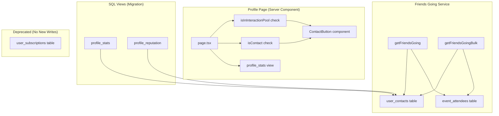

# Design Document: Contacts Replace Subscriptions

## Overview

This feature consolidates the legacy `user_subscriptions` system into the existing `user_contacts` system. The change affects three areas:

1. **Friends Going** — The service that shows "which of your connections are attending this event" switches its data source from `user_subscriptions` to `user_contacts`.
2. **Profile UI** — The Follow button is replaced with a context-aware "Add to contacts" / "Remove from contacts" button, gated by interaction pool membership.
3. **Profile Stats** — The SQL views (`profile_stats`, `profile_reputation`) recompute `follower_count` and `following_count` from `user_contacts` instead of `user_subscriptions`.

The `user_subscriptions` table is retained (no data loss) but no new code writes to it.

### Design Rationale

The contacts model is richer than subscriptions: it requires interaction pool membership (shared crew, conversation, or co-attendance) before a relationship can be created. This makes "friends going" more meaningful — it shows people you actually know, not passive follows.

## Architecture



### Key Decisions

| Decision | Choice | Rationale |
|----------|--------|-----------|
| Data source for friends-going | `user_contacts` | Aligns with the unified relationship model; contacts represent intentional connections |
| Button visibility gate | Interaction pool check (server-side) | Avoids extra client round-trip; pool logic already exists in `contacts.ts` |
| Stats migration approach | SQL view rewrite (single migration) | Views are cheap to replace; no data migration needed |
| Subscription table | Retain, stop writing | Zero-risk backward compatibility; future migration can clean up |
| `isInInteractionPool` exposure | Export as public function | Currently private helper; profile page needs direct access |

## Components and Interfaces

### Modified: `src/lib/actions/friends-going.ts`

```typescript
// Change: Replace user_subscriptions query with user_contacts query

export async function getFriendsGoing(eventId: string, max = 5): Promise<FriendGoing[]> {
  // ...auth check unchanged...
  
  const [{ data: contacts }, { data: attendees }] = await Promise.all([
    supabase
      .from('user_contacts')           // was: user_subscriptions
      .select('contact_id')            // was: target_user_id
      .eq('owner_id', user.id),        // was: subscriber_id
    supabase
      .from('event_attendees')
      .select('user_id, status, created_at')
      .eq('event_id', eventId)
      .in('status', ['going', 'waitlist', 'interested']),
  ]);

  // Intersection logic unchanged, using contact_id instead of target_user_id
  const contactSet = new Set(contacts.map(c => c.contact_id));
  const overlap = attendees.filter(a => contactSet.has(a.user_id));
  // ...sort and profile fetch unchanged...
}

export async function getFriendsGoingBulk(eventIds: string[], perEvent = 3): Promise<Record<string, FriendGoing[]>> {
  // Same pattern: user_contacts instead of user_subscriptions
}
```

### Modified: `src/lib/actions/contacts.ts`

```typescript
// Change: Export isInInteractionPool as a public server action

export async function isInInteractionPool(targetUserId: string): Promise<boolean> {
  const supabase = await createClient();
  const { data: { user } } = await supabase.auth.getUser();
  if (!user) return false;
  
  return isInInteractionPoolInternal(supabase, user.id, targetUserId);
}

// Rename existing private helper to avoid collision
async function isInInteractionPoolInternal(
  supabase: SupabaseClient,
  currentUserId: string,
  targetUserId: string,
): Promise<boolean> {
  // ...existing logic unchanged...
}
```

### New: `src/components/social/contact-button.tsx`

```typescript
'use client';

interface ContactButtonProps {
  targetUserId: string;
  isInPool: boolean;
  isContact: boolean;
}

export function ContactButton({ targetUserId, isInPool, isContact: initial }: ContactButtonProps) {
  // If not in pool, render nothing (hidden per requirement 2.3)
  if (!isInPool) return null;

  // State: isContact toggles between "Add to contacts" / "Remove from contacts"
  // Calls addContact / removeContact server actions
  // Optimistic UI update without page reload
}
```

### Modified: `src/lib/actions/social.ts`

```typescript
// REMOVED: toggleFollow, isFollowing
// RETAINED: getProfileStats, getProfileReputation, getUserBadges
```

### Removed: `src/components/social/follow-button.tsx`

Entire file deleted.

### Modified: `src/app/[locale]/profile/[id]/page.tsx`

```typescript
// Changes:
// 1. Remove: import { FollowButton } from '@/components/social/follow-button'
// 2. Remove: import { isFollowing } from '@/lib/actions/social'
// 3. Add: import { ContactButton } from '@/components/social/contact-button'
// 4. Add: import { isInInteractionPool } from '@/lib/actions/contacts'
// 5. Add: import { isContact } from '@/lib/actions/contacts' (new helper)
// 6. In data fetch: replace isFollowing(id) with isInInteractionPool(id) + isContact(id)
// 7. In render: replace <FollowButton> with <ContactButton>
```

### New helper: `isContact` in `src/lib/actions/contacts.ts`

```typescript
export async function isContact(targetUserId: string): Promise<boolean> {
  const supabase = await createClient();
  const { data: { user } } = await supabase.auth.getUser();
  if (!user) return false;

  const { data } = await supabase
    .from('user_contacts')
    .select('contact_id')
    .eq('owner_id', user.id)
    .eq('contact_id', targetUserId)
    .single();

  return !!data;
}
```

## Data Models

### Existing: `user_contacts` table

| Column | Type | Description |
|--------|------|-------------|
| owner_id | uuid (FK → profiles.id) | The user who owns the contact list |
| contact_id | uuid (FK → profiles.id) | The user being added as a contact |
| created_at | timestamptz | When the contact was added |

Primary key: `(owner_id, contact_id)`

### Existing (deprecated): `user_subscriptions` table

| Column | Type | Description |
|--------|------|-------------|
| subscriber_id | uuid (FK → profiles.id) | The follower |
| target_user_id | uuid (FK → profiles.id) | The followed user |
| created_at | timestamptz | When the follow occurred |

No new writes. Table retained for backward compatibility.

### SQL Migration: Update Views

```sql
-- Migration: Replace user_subscriptions with user_contacts in stats views

-- 1. Update profile_stats view
CREATE OR REPLACE VIEW public.profile_stats AS
SELECT
  p.id AS user_id,
  coalesce(ec.created_count, 0) AS events_created,
  coalesce(ea.attended_count, 0) AS events_attended,
  coalesce(er.avg_rating, 0) AS avg_organizer_rating,
  coalesce(er.review_count, 0) AS review_count,
  coalesce(fc.follower_count, 0) AS follower_count,
  coalesce(fg.following_count, 0) AS following_count
FROM public.profiles p
LEFT JOIN (
  SELECT organizer_id, count(*) AS created_count
  FROM public.events WHERE status IN ('published', 'completed')
  GROUP BY organizer_id
) ec ON ec.organizer_id = p.id
LEFT JOIN (
  SELECT user_id, count(*) AS attended_count
  FROM public.event_attendees WHERE status = 'going'
  GROUP BY user_id
) ea ON ea.user_id = p.id
LEFT JOIN (
  SELECT e.organizer_id, avg(r.rating)::numeric(3,2) AS avg_rating, count(*) AS review_count
  FROM public.event_reviews r
  JOIN public.events e ON e.id = r.event_id
  GROUP BY e.organizer_id
) er ON er.organizer_id = p.id
LEFT JOIN (
  SELECT contact_id, count(*) AS follower_count
  FROM public.user_contacts GROUP BY contact_id
) fc ON fc.contact_id = p.id
LEFT JOIN (
  SELECT owner_id, count(*) AS following_count
  FROM public.user_contacts GROUP BY owner_id
) fg ON fg.owner_id = p.id;

-- 2. Update profile_reputation view (followers CTE only)
-- Replace the "followers" CTE:
--   FROM: select target_user_id as user_id, count(*) ... from user_subscriptions
--   TO:   select contact_id as user_id, count(*) ... from user_contacts
```

### Indexes

The `user_contacts` table should already have indexes on `owner_id` and `contact_id` (from the contacts feature). Verify and add if missing:

```sql
CREATE INDEX IF NOT EXISTS idx_user_contacts_owner ON public.user_contacts(owner_id);
CREATE INDEX IF NOT EXISTS idx_user_contacts_contact ON public.user_contacts(contact_id);
```

## Correctness Properties

*A property is a characteristic or behavior that should hold true across all valid executions of a system — essentially, a formal statement about what the system should do. Properties serve as the bridge between human-readable specifications and machine-verifiable correctness guarantees.*

### Property 1: Friends-going returns only contacts who are attending

*For any* authenticated user with any set of contacts and any event with any set of attendees, `getFriendsGoing` SHALL return only users who are both in the viewer's `user_contacts` (as `contact_id`) AND in the event's `event_attendees` with status going/waitlist/interested.

**Validates: Requirements 1.1, 1.2, 1.3**

### Property 2: Friends-going sort order invariant

*For any* non-empty result from `getFriendsGoing`, the output SHALL be sorted such that all "going" entries precede all "waitlist" entries, which precede all "interested" entries, and within each status group entries are ordered by RSVP timestamp ascending.

**Validates: Requirements 1.4**

### Property 3: Contact button state derivation

*For any* combination of (isAuthenticated, isOwnProfile, isInPool, isContact), the contact button visibility and label SHALL be deterministic:
- NOT authenticated OR isOwnProfile → hidden
- authenticated AND NOT isInPool → hidden
- authenticated AND isInPool AND NOT isContact → "Add to contacts"
- authenticated AND isInPool AND isContact → "Remove from contacts"

**Validates: Requirements 2.1, 2.2, 2.3, 2.4**

### Property 4: Contact count correctness

*For any* user, `profile_stats.follower_count` SHALL equal the number of rows in `user_contacts` where `contact_id` equals that user's ID, and `profile_stats.following_count` SHALL equal the number of rows where `owner_id` equals that user's ID.

**Validates: Requirements 4.1, 4.2, 4.3, 4.4**

## Error Handling

| Scenario | Handling |
|----------|----------|
| `getFriendsGoing` called by unauthenticated user | Return empty array (existing behavior preserved) |
| `addContact` for user not in interaction pool | Return `{ error: 'User is not in your interaction pool' }` (existing behavior) |
| `addContact` duplicate | Return `{ success: true }` — idempotent (existing behavior) |
| `removeContact` for non-existent contact | Supabase delete is a no-op; return `{ success: true }` |
| `isInInteractionPool` for unauthenticated user | Return `false` |
| Profile page load with invalid user ID | `notFound()` (existing behavior) |
| SQL view returns null for zero-contact user | `COALESCE(..., 0)` ensures 0 is returned |

## Testing Strategy

### Property-Based Tests (fast-check)

The project already uses `fast-check` for property-based testing (see `src/__tests__/properties/`). Each correctness property maps to one property-based test with minimum 100 iterations.

| Property | Test File | What's Generated |
|----------|-----------|-----------------|
| P1: Friends-going contacts intersection | `contacts-friends-going.property.test.ts` | Random contact lists, random attendee lists, verify intersection correctness |
| P2: Sort order invariant | `contacts-friends-going.property.test.ts` | Random attendees with mixed statuses/timestamps, verify ordering |
| P3: Button state derivation | `contact-button-state.property.test.ts` | Random boolean tuples (auth, ownProfile, inPool, isContact), verify deterministic output |
| P4: Contact count correctness | `contact-count-stats.property.test.ts` | Random user_contacts rows, verify counts match |

Each test tagged: `Feature: contacts-replace-subscriptions, Property {N}: {title}`

### Unit Tests (example-based)

- `addContact` / `removeContact` optimistic UI update (mock server actions)
- Translation key presence across all 5 locales
- Profile page does not call `isInInteractionPool` for own profile
- `toggleFollow` and `isFollowing` exports no longer exist in `social.ts`
- `FollowButton` component file no longer exists

### Integration Tests

- Profile page renders ContactButton with correct props for authenticated non-own profile
- SQL migration: insert contacts, query `profile_stats` view, verify counts
- End-to-end: add contact → friends-going shows that user on shared event

### Migration Safety

- The migration only replaces view definitions (no data changes)
- `user_subscriptions` table and its indexes are untouched
- Rollback: re-run the original view definitions from migration 009/037
