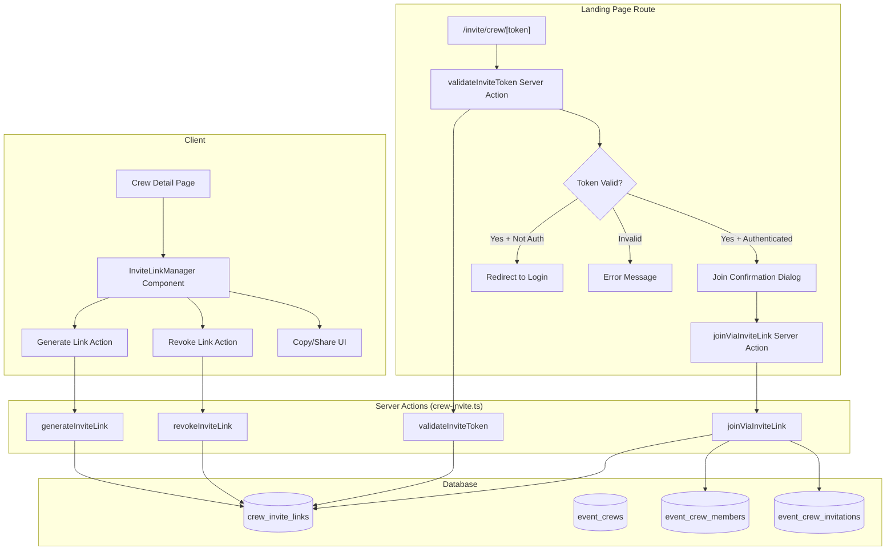

# Design Document: Crew Invite Link

## Overview

This feature extends the existing Event Crew system with shareable invite links. Crew Hosts and Moderators can generate unique URLs that can be shared via external channels (Telegram, WhatsApp, email, etc.). Recipients who open the link see a confirmation dialog with crew and event details, and can join with one click.

The design integrates with the existing crew membership logic (capacity checks, one-crew-per-event constraint, role hierarchy) and adds a new `crew_invite_links` table, server actions for link lifecycle management, a public landing page route, and UI components for link management and sharing.

**Key design decisions:**
- Links are **multi-use** (not single-use tokens) — one link can be used by multiple people until it expires, is revoked, or the crew fills up.
- Token validation happens both at page load AND at join confirmation time to handle race conditions.
- Links are automatically deactivated on crew capacity fill, crew deletion, crew archival, event cancellation, event end, and inviter departure.
- The invite link landing page is a **public route** (no auth required for the page itself) but joining requires authentication.

## Architecture



## Components and Interfaces

### Server Actions (`src/lib/actions/crew-invite.ts`)

#### `generateInviteLink`

```typescript
const generateInviteLinkSchema = z.object({
  crew_id: z.string().uuid(),
});

export async function generateInviteLink(
  input: { crew_id: string }
): Promise<{ link?: CrewInviteLink; url?: string; error?: string }>
```

**Preconditions validated:**
1. User is authenticated
2. User is host or moderator of the crew
3. Crew exists and is active (not archived)
4. Crew is not at capacity
5. Associated event has not ended
6. Crew has fewer than 5 active (non-expired, non-revoked) invite links
7. Crew has not exceeded the 20 total invitation limit (standard + invite-link joins)
8. Crew has not exceeded 10 link generations in the rolling 24-hour window

**On success:**
- Generates a cryptographically random URL-safe token (48 characters using `crypto.randomBytes(36).toString('base64url')`)
- Inserts a record into `crew_invite_links`
- Returns the link record and formatted URL

#### `revokeInviteLink`

```typescript
export async function revokeInviteLink(
  input: { link_id: string }
): Promise<{ success?: boolean; error?: string }>
```

**Authorization:**
- Host can revoke any link for their crew
- Moderator can revoke only links they generated themselves
- Members and non-participants cannot revoke

#### `validateInviteToken`

```typescript
export type InviteTokenValidationResult =
  | { status: 'valid'; crew: CrewInviteData; event: EventInviteData; inviter: InviterData }
  | { status: 'expired' }
  | { status: 'revoked' }
  | { status: 'crew_deleted' }
  | { status: 'crew_archived' }
  | { status: 'crew_full'; eventId: string }
  | { status: 'event_ended' }
  | { status: 'invalid' }
  | { status: 'already_member'; crewId: string; eventId: string }
  | { status: 'blocked' };

export async function validateInviteToken(
  token: string,
  userId?: string
): Promise<InviteTokenValidationResult>
```

**Validation order:**
1. Token exists in database → if not, return `invalid`
2. Token is not revoked → if revoked, return `revoked`
3. Token is not expired (current time < expires_at) → if expired, return `expired`
4. Crew exists → if not, return `crew_deleted`
5. Crew is active → if archived, return `crew_archived`
6. Event has not ended → if ended, return `event_ended`
7. Crew is not full → if full, return `crew_full`
8. If userId provided: user is not blocked → if blocked, return `blocked`
9. If userId provided: user is not already a member → if member, return `already_member`
10. Return `valid` with crew, event, and inviter data

#### `joinViaInviteLink`

```typescript
export async function joinViaInviteLink(
  input: { token: string }
): Promise<{ success?: boolean; crewId?: string; eventId?: string; error?: string }>
```

**Preconditions re-validated at join time:**
1. User is authenticated
2. Token is still valid (not expired, not revoked)
3. Crew is still active and not full
4. Event has not ended
5. User is not blocked
6. User is not already in another crew for this event
7. User is not the event organizer (for non-system events)
8. User was not previously kicked from this crew
9. Total invitation count has not reached 20

**On success:**
1. Insert into `event_crew_members` with role = 'member'
2. Increment `participant_count` on `event_crews`
3. Increment `use_count` on `crew_invite_links`
4. Cancel all pending invitations for this user for the same event
5. Cancel all pending join requests for this user for the same event
6. Insert system message: "{userName} joined the crew via invite link from {inviterName}."
7. Notify all existing crew members
8. If crew is now full, deactivate all active invite links for this crew

#### `getActiveInviteLinks`

```typescript
export async function getActiveInviteLinks(
  input: { crew_id: string }
): Promise<{ links?: CrewInviteLink[]; error?: string }>
```

Returns all active (non-expired, non-revoked) invite links for a crew. Only accessible by host/moderator.

#### `deactivateInviterLinks`

```typescript
export async function deactivateInviterLinks(
  crewId: string,
  userId: string
): Promise<void>
```

Internal helper called when a user leaves or is removed from a crew. Deactivates all active invite links generated by that user.

### Landing Page Route

**Path:** `src/app/[locale]/invite/crew/[token]/page.tsx`

This is a server component that:
1. Reads the token from params
2. Calls `validateInviteToken` (passing userId if authenticated)
3. Based on the result:
   - `valid` → renders `JoinConfirmationDialog`
   - `already_member` → redirects to crew detail page
   - `crew_full` → redirects to event page with toast param
   - Auth required → redirects to login with `redirectTo` param
   - Error states → renders appropriate error message component

**`generateMetadata` for OG tags:**

```typescript
export async function generateMetadata({ params }: Props): Promise<Metadata> {
  const { token } = await params;
  // Fetch minimal crew+event data for OG tags (no auth required)
  const data = await getInviteLinkOGData(token);
  if (!data) return { title: 'Invalid Invite Link' };

  return buildPageMetadata({
    locale,
    path: `/invite/crew/${token}`,
    title: `Join "${data.crewName}" for ${data.eventTitle}`,
    description: `You're invited to join a crew for ${data.eventTitle}`,
    image: data.eventCoverUrl || null,
    imageAlt: `${data.crewName} — ${data.eventTitle}`,
    type: 'website',
    robots: { index: false, follow: false },
  });
}
```

### UI Components

#### `InviteLinkManager` (`src/components/crew/InviteLinkManager.tsx`)

Rendered inside the existing `CrewPanel` component for host/moderator users. Displays:
- "Generate Invite Link" button (disabled when at 5 active links or crew is full)
- List of active invite links with: creation date, expiration date, creator name, use count
- Revoke button per link (respecting authorization rules)

#### `InviteLinkShareCard` (`src/components/crew/InviteLinkShareCard.tsx`)

Shown after link generation. Contains:
- Full URL as selectable text
- "Copy to clipboard" button (uses `navigator.clipboard.writeText`)
- "Share" button (conditionally rendered when `navigator.share` is available)
- Pre-filled share text: `"Присоединяйся к компании «{crewName}» на {eventName}! {url}"` (localized)

#### `JoinConfirmationDialog` (`src/components/crew/JoinConfirmationDialog.tsx`)

Client component rendered on the landing page. Displays:
- Crew name
- Event name, start date/time, venue
- Inviter display name and avatar
- Participant count (e.g., "4/6") and available spots
- "Присоединиться" (Join) button — calls `joinViaInviteLink`
- "Отклонить" (Decline) button — redirects to event page

#### `InviteLinkErrorState` (`src/components/crew/InviteLinkErrorState.tsx`)

Renders localized error messages for invalid/expired/revoked states with appropriate icons and suggested actions.

## Data Models

### New Table: `crew_invite_links`

```sql
-- Migration: 061_crew_invite_links.sql

create table public.crew_invite_links (
  id uuid primary key default uuid_generate_v4(),
  crew_id uuid not null references public.event_crews(id) on delete cascade,
  created_by uuid not null references public.profiles(id) on delete cascade,
  token text not null unique,
  status text not null default 'active' check (status in ('active', 'revoked', 'expired', 'deactivated')),
  use_count integer not null default 0,
  created_at timestamptz not null default now(),
  expires_at timestamptz not null,
  revoked_at timestamptz,
  constraint token_length check (char_length(token) between 32 and 128)
);

-- Fast lookup by token (primary access pattern for landing page)
create unique index idx_crew_invite_links_token
  on public.crew_invite_links (token);

-- Active links per crew (for limit enforcement and management panel)
create index idx_crew_invite_links_crew_active
  on public.crew_invite_links (crew_id)
  where status = 'active';

-- Links by creator (for deactivation when user leaves)
create index idx_crew_invite_links_creator
  on public.crew_invite_links (created_by, crew_id)
  where status = 'active';

-- Rate limit check (links created in last 24h per crew)
create index idx_crew_invite_links_crew_created
  on public.crew_invite_links (crew_id, created_at desc);
```

### New Table: `crew_invite_link_joins` (audit log)

```sql
create table public.crew_invite_link_joins (
  id uuid primary key default uuid_generate_v4(),
  link_id uuid not null references public.crew_invite_links(id) on delete cascade,
  user_id uuid not null references public.profiles(id) on delete cascade,
  joined_at timestamptz not null default now()
);

create index idx_crew_invite_link_joins_link
  on public.crew_invite_link_joins (link_id);

create index idx_crew_invite_link_joins_user
  on public.crew_invite_link_joins (user_id);
```

### New Table: `crew_kicked_members` (track kicked users)

```sql
create table public.crew_kicked_members (
  crew_id uuid not null references public.event_crews(id) on delete cascade,
  user_id uuid not null references public.profiles(id) on delete cascade,
  kicked_at timestamptz not null default now(),
  kicked_by uuid not null references public.profiles(id) on delete cascade,
  primary key (crew_id, user_id)
);
```

### RLS Policies

```sql
-- crew_invite_links: SELECT by crew host/moderator or by token lookup
alter table public.crew_invite_links enable row level security;

create policy "crew_invite_links_select_member"
  on public.crew_invite_links for select
  to authenticated
  using (
    exists (
      select 1 from public.event_crew_members m
      where m.crew_id = crew_invite_links.crew_id
        and m.user_id = auth.uid()
        and m.role in ('host', 'moderator')
    )
  );

-- Public token lookup (for landing page validation)
create policy "crew_invite_links_select_by_token"
  on public.crew_invite_links for select
  to authenticated
  using (true);  -- Token lookup is done server-side with service role

create policy "crew_invite_links_insert"
  on public.crew_invite_links for insert
  to authenticated
  with check (
    created_by = auth.uid()
    and exists (
      select 1 from public.event_crew_members m
      where m.crew_id = crew_invite_links.crew_id
        and m.user_id = auth.uid()
        and m.role in ('host', 'moderator')
    )
  );

create policy "crew_invite_links_update"
  on public.crew_invite_links for update
  to authenticated
  using (
    -- Host can update any link for their crew
    exists (
      select 1 from public.event_crew_members m
      where m.crew_id = crew_invite_links.crew_id
        and m.user_id = auth.uid()
        and m.role = 'host'
    )
    -- Or creator can update their own link
    or created_by = auth.uid()
  );
```

### TypeScript Types (`src/types/database.ts` additions)

```typescript
export type CrewInviteLinkStatus = 'active' | 'revoked' | 'expired' | 'deactivated';

export interface CrewInviteLink {
  id: string;
  crew_id: string;
  created_by: string;
  token: string;
  status: CrewInviteLinkStatus;
  use_count: number;
  created_at: string;
  expires_at: string;
  revoked_at: string | null;
}

export interface CrewInviteLinkJoin {
  id: string;
  link_id: string;
  user_id: string;
  joined_at: string;
}

export interface CrewKickedMember {
  crew_id: string;
  user_id: string;
  kicked_at: string;
  kicked_by: string;
}
```

### Constants (`src/lib/constants/crew.ts` additions)

```typescript
// Invite link constraints
export const MAX_ACTIVE_INVITE_LINKS_PER_CREW = 5;
export const INVITE_LINK_EXPIRY_DAYS = 7;
export const INVITE_LINK_TOKEN_BYTES = 36; // produces 48 base64url chars
export const MAX_INVITE_LINK_GENERATIONS_PER_24H = 10;
```

### Notification Type Addition

The `notifications_type_check` constraint needs to be widened to include `'crew_member_joined_via_link'` (or reuse existing `'crew_member_joined'` type with additional metadata).

**Decision:** Reuse existing `'crew_member_joined'` notification type. The notification body will differentiate by including "via invite link from {inviterName}" text.

### Integration with Existing Crew Actions

The existing `removeMember` and `leaveCrew` actions in `src/lib/actions/crew.ts` need to be extended to call `deactivateInviterLinks` when a user is removed or leaves. This ensures Requirement 1.14 is satisfied.

**Modification points:**
- `removeMember`: After successful removal, call `deactivateInviterLinks(crew_id, input.user_id)` and insert into `crew_kicked_members`.
- `leaveCrew`: After successful departure, call `deactivateInviterLinks(crew_id, user.id)`.

## Correctness Properties

*A property is a characteristic or behavior that should hold true across all valid executions of a system — essentially, a formal statement about what the system should do. Properties serve as the bridge between human-readable specifications and machine-verifiable correctness guarantees.*

### Property 1: Token generation format

*For any* generated invite link token, the token SHALL be a URL-safe string (matching `[A-Za-z0-9_-]+`) with length between 32 and 128 characters, and the formatted URL SHALL match the pattern `{base_url}/invite/crew/{token}`.

**Validates: Requirements 1.1, 1.4, 6.1**

### Property 2: Generated link record integrity

*For any* successfully generated invite link, the stored record SHALL have `crew_id` matching the requested crew, `created_by` matching the authenticated user, and `expires_at` equal to `created_at` plus exactly 7 days.

**Validates: Requirements 1.2, 1.3, 6.9**

### Property 3: Generation precondition enforcement

*For any* crew that violates at least one precondition (crew is at capacity, crew is archived, crew has 5 active links, associated event has ended, total invitation count >= 20, or 10 links generated in last 24 hours), invite link generation SHALL return an error and no new link record SHALL be created.

**Validates: Requirements 1.5, 1.6, 1.7, 1.12, 5.10, 6.2, 6.4, 6.5**

### Property 4: Token validation rejects invalid states

*For any* invite link token that is expired (current time > expires_at) or has status 'revoked' or 'deactivated', the `validateInviteToken` function SHALL return a non-valid status and SHALL NOT allow joining.

**Validates: Requirements 1.9, 5.5**

### Property 5: Revocation authorization

*For any* invite link, the Crew Host SHALL be able to revoke it regardless of who created it; a Crew Moderator SHALL be able to revoke only links where `created_by` equals their own user ID; and any user who is a regular member or non-participant SHALL receive a permission error when attempting to revoke.

**Validates: Requirements 5.3, 5.4, 5.8**

### Property 6: Join via link adds member and inserts system message

*For any* valid invite link and eligible user who confirms joining, the system SHALL add the user to `event_crew_members` with role 'member', increment `participant_count`, and insert a system message in the crew chat containing the joiner's name and the inviter's name.

**Validates: Requirements 4.1, 7.2**

### Property 7: Join precondition enforcement

*For any* user attempting to join via invite link who violates at least one precondition (already in another crew for the same event, is the event organizer of a non-system event, or was previously kicked from this crew), the join attempt SHALL be rejected and no membership record SHALL be created.

**Validates: Requirements 4.6, 4.8, 4.12, 6.11**

### Property 8: Re-validation at join time

*For any* invite link token that was valid at page load time but becomes invalid (expired, revoked, or deactivated) before the user confirms joining, the `joinViaInviteLink` action SHALL reject the join attempt.

**Validates: Requirements 4.10**

### Property 9: Landing page data completeness

*For any* valid invite link, the Join Confirmation Dialog data SHALL include the event start date/time, event venue name, crew name, current participant count, configured capacity, and number of available spots; and the page's Open Graph metadata SHALL include og:title containing the crew name, og:description containing the event name, and og:image with the event cover URL.

**Validates: Requirements 3.8, 3.18**

### Property 10: Already-member redirect

*For any* authenticated user who is already a participant of the target crew, opening the invite link SHALL redirect to the crew detail page without showing the Join Confirmation Dialog.

**Validates: Requirements 3.13, 3.14**

### Property 11: Share text completeness

*For any* crew name and event name, the pre-filled share text SHALL contain the crew name, the event name, and the full invite link URL.

**Validates: Requirements 2.5**

## Error Handling

| Scenario | Error Code | User Message (i18n key) | Action |
|----------|-----------|------------------------|--------|
| Token not found | `INVALID_TOKEN` | `invite.error.invalid` | Show error page |
| Token expired | `TOKEN_EXPIRED` | `invite.error.expired` | Show error page with "ask sender for new link" |
| Token revoked | `TOKEN_REVOKED` | `invite.error.revoked` | Show error page |
| Crew deleted | `CREW_DELETED` | `invite.error.crewDeleted` | Show error page |
| Crew archived | `CREW_ARCHIVED` | `invite.error.crewArchived` | Show error page |
| Crew full | `CREW_FULL` | `invite.error.crewFull` | Redirect to event page + toast |
| Event ended | `EVENT_ENDED` | `invite.error.eventEnded` | Show error page |
| User blocked (platform) | `USER_BLOCKED` | `invite.error.invalid` | Show generic error (no info leak) |
| User blocked host | `BLOCKED_HOST` | `invite.error.cannotJoin` | Show error page |
| Already in crew for event | `ALREADY_IN_CREW` | `invite.error.alreadyInCrew` | Show error with instruction to leave current crew |
| User is event organizer | `IS_ORGANIZER` | `invite.error.organizerCannotJoin` | Show error page |
| User was kicked | `KICKED` | `invite.error.cannotJoin` | Show error page |
| Not authenticated | `AUTH_REQUIRED` | — | Redirect to login with `redirectTo` |
| Generation: crew full | `CREW_FULL` | `invite.generate.crewFull` | Disable button, show message |
| Generation: crew archived | `CREW_ARCHIVED` | `invite.generate.crewArchived` | Hide generate button |
| Generation: max links reached | `MAX_LINKS` | `invite.generate.maxLinks` | Disable button, show count |
| Generation: invitation limit | `INVITATION_LIMIT` | `invite.generate.invitationLimit` | Disable button, show message |
| Generation: rate limited | `RATE_LIMITED` | `invite.generate.rateLimited` | Disable button, show cooldown |
| Generation: event ended | `EVENT_ENDED` | `invite.generate.eventEnded` | Hide generate button |
| Revoke: not authorized | `NOT_AUTHORIZED` | `invite.revoke.notAuthorized` | Show error toast |
| Clipboard write failed | `CLIPBOARD_FAILED` | `invite.share.clipboardFailed` | Show error toast, keep URL visible |
| Race condition: crew filled during join | `CREW_FULL` | `invite.error.crewFull` | Redirect to event page + toast |

## Testing Strategy

### Property-Based Tests (fast-check + vitest)

The project uses `fast-check` (v4.7.0) with `vitest` (v4.1.5). Each property test runs a minimum of 100 iterations.

**Test file:** `src/__tests__/properties/crew-invite-link.property.test.ts`

Properties 1–11 from the Correctness Properties section will be implemented as property-based tests with mocked Supabase client (following the pattern in `toggle-round-trip.property.test.ts`).

**Key generators:**
- `crewArb`: generates random crew objects with varying capacity, participant_count, status, visibility
- `inviteLinkArb`: generates random invite link records with varying status, expiry, token
- `userArb`: generates random user profiles with varying roles, blocked status
- `tokenArb`: generates random URL-safe strings of 32-128 characters

**Tag format:** `Feature: crew-invite-link, Property {N}: {title}`

### Unit Tests (example-based)

**Test file:** `src/__tests__/unit/crew-invite.test.ts`

- Clipboard copy success/failure handling
- Web Share API availability detection
- Share dialog cancellation handling
- Redirect flow preservation through auth
- OG metadata generation for various crew/event states
- Decline button redirect behavior
- Deactivation cascade on crew deletion (via CASCADE)
- Voluntary leaver can rejoin (vs kicked user cannot)

### Integration Tests

- Full join flow: generate link → open link → validate → join → verify membership
- Cascade deactivation: member leaves → their links deactivated
- Capacity fill → all links deactivated
- Event cancellation → crew archived → links deactivated
- Rate limit enforcement across multiple rapid generations
- Notification delivery on join (with retry on failure)

### Configuration

```typescript
// vitest property test configuration
{ numRuns: 100 }
```

Each property test is tagged with a comment referencing the design property:
```typescript
/**
 * Feature: crew-invite-link, Property 1: Token generation format
 * ...
 */
```
