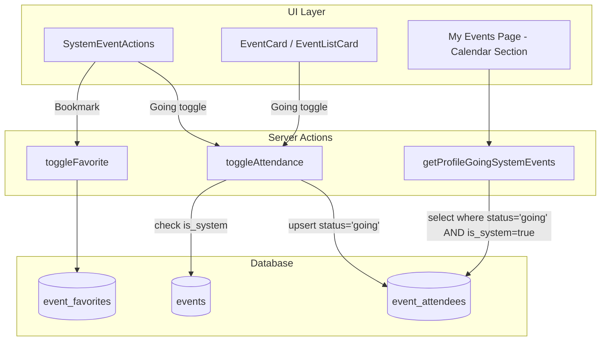

# Design Document: System Event RSVP Unification

## Overview

This feature unifies the RSVP model for system events with community events by replacing the "Interested" status with the standard "Going" status. The change simplifies the attendance model, enables Crew matching on system events via the existing interaction pool, and provides users with a consistent experience across all event types.

**Key design decisions:**
- No schema migration needed — the `event_attendees` table already supports `status = 'going'`
- A data migration deletes existing `interested` records for system events (one-time cleanup)
- `toggleAttendance` is modified to skip capacity/waitlist logic when `is_system = true`
- `setInterest` is removed entirely from the codebase
- The `SystemEventActions` component is refactored to show a Going button instead of the Interest star
- `getProfileInterestedSystemEvents` is renamed to `getProfileGoingSystemEvents` and queries `status = 'going'`

## Architecture



**Data flow for system event RSVP:**
1. User clicks "Иду" (Going) button on a system event
2. `toggleAttendance` is called with the event ID
3. Action checks `events.is_system` — if true, skips capacity/waitlist logic
4. Upserts `event_attendees` with `status = 'going'` (or deletes if already going)
5. Returns the new status to the client
6. UI updates the button state optimistically

## Components and Interfaces

### Modified: `toggleAttendance` (server action)

```typescript
export async function toggleAttendance(
  eventId: string,
): Promise<{ error?: string; status?: AttendanceStatus }> {
  const supabase = await createClient();
  const { data: { user } } = await supabase.auth.getUser();
  if (!user) return { error: 'Not authenticated' };

  const { data: ev } = await supabase
    .from('events')
    .select('is_system')
    .eq('id', eventId)
    .single();

  const { data: existing } = await supabase
    .from('event_attendees')
    .select('status')
    .eq('event_id', eventId)
    .eq('user_id', user.id)
    .single();

  // Toggle off: if already going (or waitlist for community), remove
  if (existing && (existing.status === 'going' || existing.status === 'waitlist')) {
    await supabase
      .from('event_attendees')
      .delete()
      .eq('event_id', eventId)
      .eq('user_id', user.id);
    return { status: 'none' };
  }

  // For system events: always set 'going', no capacity check
  if (ev?.is_system) {
    const { data: inserted } = await supabase
      .from('event_attendees')
      .upsert({ event_id: eventId, user_id: user.id, status: 'going' })
      .select('status')
      .single();
    return { status: normalizeAttendanceStatus(inserted?.status) };
  }

  // For community events: upsert as 'going'; DB trigger may downgrade to 'waitlist'
  const { data: inserted } = await supabase
    .from('event_attendees')
    .upsert({ event_id: eventId, user_id: user.id, status: 'going' })
    .select('status')
    .single();

  return { status: normalizeAttendanceStatus(inserted?.status) };
}
```

**Changes:**
- Remove the early-return guard that rejected system events with `'system_events_no_rsvp'`
- Add a branch for `is_system` that upserts 'going' directly without capacity logic
- Community event path remains unchanged (DB trigger still handles waitlist downgrade)

### Removed: `setInterest` (server action)

The entire `setInterest` function is deleted from `src/lib/actions/events.ts`. All imports of `setInterest` across the codebase are removed.

### Modified: `SystemEventActions` (component)

```typescript
interface SystemEventActionsProps {
  event: { id: string; title: string; /* ... */ };
  initialStatus?: AttendanceStatus;
  initialFavorited: boolean;
  isAuthenticated: boolean;
  meetupCta?: { label: string; href?: string; count?: number };
}
```

**Changes:**
- Replace `handleToggleInterest` with `handleToggleGoing` that calls `toggleAttendance`
- Replace the Star icon button with a Going button (same style as `EventActions`)
- Keep Favorite (Heart) button unchanged
- Keep Share and AddToCalendar buttons unchanged
- Remove all references to `setInterest`

### Modified: `getProfileGoingSystemEvents` (renamed from `getProfileInterestedSystemEvents`)

```typescript
export async function getProfileGoingSystemEvents(userId: string) {
  const supabase = await createClient();
  const { data: rows } = await supabase
    .from('event_attendees')
    .select('event_id')
    .eq('user_id', userId)
    .eq('status', 'going');  // Changed from 'interested' to 'going'

  if (!rows || rows.length === 0) return [];

  const ids = rows.map((r) => r.event_id);
  const nowIso = new Date().toISOString();

  const { data } = await supabase
    .from('events_with_counts')
    .select('*')
    .in('id', ids)
    .eq('is_system', true)
    .eq('is_blocked', false)
    .eq('organizer_is_blocked', false)
    .gte('ends_at', nowIso)
    .order('starts_at', { ascending: true });

  return data || [];
}
```

### Modified: Event Cards (`event-card.tsx`, `event-list-card.tsx`)

- Remove `handleToggleInterest` handler and Star button for system events
- Remove `interestedCount` state and display for system events
- Add Going button for system events (reuse existing going toggle logic)
- Keep interested button for community events removed per Requirement 3.4

### Modified: Event Detail Page (`page.tsx`)

- Replace `interestedCount` display with `going_count` for system events in the sidebar counter
- The `SystemEventActions` component now shows Going instead of Interested

### Impact on `getFriendsGoing` / `getFriendsGoingBulk`

No changes needed. These functions already query `event_attendees` with `status IN ('going', 'waitlist', 'interested')`. After migration removes 'interested' records for system events, the functions will naturally return only 'going' friends for system events. The `FriendGoing` type's `status` field can retain 'interested' for backward compatibility with community events that may still have interested records.

### Impact on Crew Interaction Pool

The Crew feature already uses mutual 'going' RSVP to build the interaction pool. Once system events support 'going' status, users who RSVP to system events automatically enter the interaction pool. The `CrewEventBlock` component already renders for system events when `isSystemEvent || event.allow_crews` — no changes needed there.

### Impact on Notifications

If any notification logic triggers on `event_attendees` inserts (e.g., "your friend is going"), it will now fire for system events too. This is the desired behavior — system events should participate in the same social signals as community events.

## Data Models

### Database Migration (060_unify_system_event_rsvp.sql)

```sql
-- Migration: Delete 'interested' records for system events
-- No schema changes needed — 'going' status already exists in the enum

-- Remove all 'interested' attendance records for system events
DELETE FROM event_attendees
WHERE status = 'interested'
  AND event_id IN (
    SELECT id FROM events WHERE is_system = true
  );

-- Optional: Add a comment documenting the policy
COMMENT ON TABLE event_attendees IS
  'System events (is_system=true) only use status=going. The interested status is reserved for community events only (enforced at application layer).';
```

### No Schema Changes

The `event_attendees` table already has:
- `event_id` (uuid, FK to events)
- `user_id` (uuid, FK to profiles)
- `status` (text: 'going', 'waitlist', 'interested', 'attended', 'no_show', 'cancelled')
- `created_at` (timestamptz)

The 'going' status is already a valid value. No enum changes, no new columns, no new tables.

### `events_with_counts` View

The `events_with_counts` view likely computes `interested_count` and `going_count`. After migration:
- `interested_count` for system events will be 0 (no interested records exist)
- `going_count` for system events will reflect actual RSVP count
- The view itself doesn't need modification — it already counts by status

## Correctness Properties

*A property is a characteristic or behavior that should hold true across all valid executions of a system — essentially, a formal statement about what the system should do. Properties serve as the bridge between human-readable specifications and machine-verifiable correctness guarantees.*

### Property 1: Toggle round-trip

*For any* system event and any authenticated user, calling `toggleAttendance` once should result in status 'going', and calling it a second time should result in status 'none' (the record is removed).

**Validates: Requirements 1.1, 1.2**

### Property 2: No capacity restriction for system events

*For any* system event, regardless of the number of existing attendees (0 to N), calling `toggleAttendance` should always result in status 'going' and never 'waitlist'.

**Validates: Requirements 2.1, 2.2**

### Property 3: System events reject interested status

*For any* system event, the system should not allow a record with status 'interested' to exist in `event_attendees`. After the migration and code changes, no code path can create such a record.

**Validates: Requirements 3.3**

### Property 4: Favorites orthogonal to RSVP

*For any* event (system or community) and any user, toggling the favorite status should not affect the user's attendance record in `event_attendees`, and toggling attendance should not affect the user's record in `event_favorites`.

**Validates: Requirements 4.1, 4.2**

### Property 5: Calendar returns going system events sorted by time

*For any* user with one or more 'going' records on system events, `getProfileGoingSystemEvents` should return exactly those upcoming system events, ordered by `starts_at` ascending, excluding events that are only favorited.

**Validates: Requirements 5.1, 5.2, 5.3**

### Property 6: Crew always enabled for system events

*For any* system event, regardless of the stored `allow_crews` value (true or false), the system should treat crew creation as enabled.

**Validates: Requirements 6.1**

### Property 7: Going users enter interaction pool

*For any* user with status 'going' on a system event, that user should be included in the Crew interaction pool for that event, enabling matching with other 'going' users.

**Validates: Requirements 6.2, 6.3**

## Error Handling

| Scenario | Handling |
|----------|----------|
| Unauthenticated user clicks Going | Return `{ error: 'Not authenticated' }`, UI shows login prompt |
| Event ID doesn't exist | Supabase returns null for event lookup; action returns gracefully with no status change |
| Network failure during toggle | Optimistic UI reverts to previous state; toast shows error |
| Stale client calls removed `setInterest` | Module export doesn't exist; client gets a runtime error (acceptable — forces app update) |
| Race condition: two rapid toggles | Last-write-wins via upsert; UI settles to correct state on response |
| Migration fails mid-execution | Transaction rolls back; no partial deletes. Re-run is safe (DELETE is idempotent for matching rows) |

## Testing Strategy

### Property-Based Tests (fast-check)

The project uses TypeScript with Vitest. Property-based tests will use `fast-check` with minimum 100 iterations per property.

Each property test will:
- Mock Supabase client responses to isolate logic
- Generate random event/user combinations
- Verify the universal property holds across all generated inputs

**Tag format:** `Feature: system-event-rsvp-unification, Property {N}: {description}`

Properties to implement:
1. Toggle round-trip (Property 1)
2. No capacity restriction (Property 2)
3. Interested status rejection (Property 3)
4. Favorites orthogonality (Property 4)
5. Calendar query correctness (Property 5)
6. Crew enablement (Property 6)
7. Interaction pool inclusion (Property 7)

### Unit Tests (example-based)

- System event detail page renders Going button (not Interest star)
- Community event pages no longer render Interest button (Req 3.4)
- System event cards don't show `interested_count`
- Favorite button still renders on system event pages
- `setInterest` export no longer exists in the module

### Integration Tests

- Data migration correctly removes interested records for system events only (leaves community event interested records intact)
- End-to-end: user RSVPs going to system event → appears in Calendar section → appears in Crew pool
- Friends-going cue shows friends with 'going' status on system events

### Smoke Tests

- Migration 060 runs without errors on a fresh database
- `setInterest` is not importable from `@/lib/actions/events`
